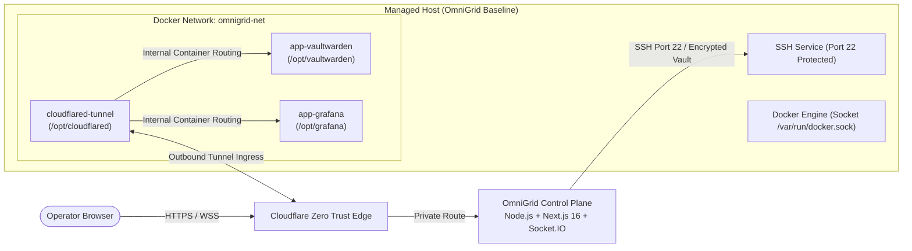

# OmniGrid Network Architecture

> Zero Trust server operations platform and control plane for homelabs, private fleets, and self-hosted infrastructure.

OmniGrid gives you a secure, unified web control plane to manage servers, SSH access, container workloads, Cloudflare Tunnels, identity, and workspace-scoped integrations from one interface. It is built for operators who want a modern management cockpit without compromising Zero Trust security principles.



---

## The OmniGrid Operating Standard

OmniGrid is a **Zero Trust operations standard**, not just a dashboard. It defines how every server in your fleet should be prepared, networked, and operated so workloads can be deployed and published securely without opening inbound ports on firewalls.

### The 5 Baseline Host Rules

1. **Docker Engine**: Every managed host runs Docker Engine with automated daemon log-rotation limits.
2. **External Discovery Boundary (`omnigrid-net`)**: Every managed host creates a shared external Docker network named `omnigrid-net`. Only containers attached to this network are discovered and operated by the control plane.
3. **Zero Trust Ingress via Cloudflare Tunnel**: Every host runs `cloudflared` in `/opt/cloudflared` attached to `omnigrid-net`. Publishing internal services is as simple as routing public hostnames directly to container names (e.g. `vault.example.com` ➔ `http://vaultwarden-app:80`).
4. **Standard File Structure (`/opt`)**: Workloads reside in dedicated folders under `/opt/<app-name>` using standard `docker-compose.yml` blueprints.
5. **Direct, Secure SSH Access (Port 22)**: OmniGrid connects to target nodes using standard SSH (Port 22) originating from the control plane only, utilizing encrypted credentials stored in the platform vault.

---

## 4-Step Operational Workflow

```
[ 01. Bootstrap ] ──> [ 02. Register ] ──> [ 03. Deploy & Expose ] ──> [ 04. Operate & Monitor ]
  Run bootstrap.sh      Add node & SSH user     Launch app on omnigrid-net     Live logs, terminal tabs,
  on clean Linux host   in OmniGrid web UI      & sync Cloudflare DNS CNAME     and automated uptime
```

1. **Bootstrap the Host**
   - Run the one-line bootstrap script on any Linux machine.
   - Installs Docker, creates `omnigrid-net`, sets up `/opt/cloudflared`, protects SSH port 22, and creates standard compose templates.
2. **Register Node in OmniGrid**
   - Create or select an encrypted credential profile (SSH key or password).
   - Register the host IP/hostname, SSH port 22, and user in **Nodes**.
3. **Deploy & Expose Workloads**
   - Place application compose in `/opt/<app-name>/docker-compose.yml` attached to `omnigrid-net`.
   - Publish hostname via Cloudflare Zero Trust directly pointing to `http://<container_name>:<port>`. No host port forwarding (`ports:`) required!
4. **Operate from One Control Plane**
   - Stream live container logs (*Dozzle-style*) and execute remote lifecycle actions.
   - Open multi-tab interactive web SSH sessions.
   - Monitor endpoint latency, SSL expiration, and uptime status.

---

## Standard Workload Template (`docker-compose.template.yml`)

Every application managed under the OmniGrid standard follows this clean blueprint (available on bootstrapped nodes at `/opt/omnigrid/docker-compose.template.yml`):

```yaml
services:
  # ----------------------------------------------------
  # SERVICE: APLIKASI UTAMA (Web/API/Bot)
  # ----------------------------------------------------
  app-utama:
    # Menggunakan image dari registry atau build lokal
    image: vaultwarden/server:latest
    
    # WAJIB: Nama unik agar langsung dapat dipanggil oleh Cloudflare Tunnel
    container_name: vaultwarden-app
    
    # WAJIB: Selalu restart otomatis jika server reboot
    restart: unless-stopped
    
    # Variabel environment rahasia
    env_file:
      - .env
      
    # Data persisten
    volumes:
      - ./data:/data
    
    # WAJIB: Bergabung ke Virtual LAN OmniGrid (tanpa perlu expose port publik)
    networks:
      - omnigrid-net

# ----------------------------------------------------
# DEKLARASI JARINGAN GLOBAL (WAJIB)
# ----------------------------------------------------
networks:
  omnigrid-net:
    external: true
```

---

## Platform Architecture & Tech Stack

| Layer | Choice | Rationale |
|---|---|---|
| **Frontend** | Next.js 16 App Router · React 19 · TailwindCSS v4 · shadcn/ui | Modern Server Components, Dark Glassmorphism, accessible primitives |
| **Backend & Realtime** | Node.js Custom Server + Next.js handlers + Socket.IO | Single-port HTTP/WebSocket unified server without reverse-proxy hopping |
| **SSH & Execution** | `ssh2` with agent / key / password profiles | Direct PTY multiplexing, session buffer replay, remote docker diagnostics |
| **Database** | SQLite via `better-sqlite3` + structured migrations | High-speed, local zero-latency relational store with tenant scoping |
| **Crypto Vault** | AES-256-GCM with PBKDF2 + Auth Tag | Tenant integration secrets & credentials encrypted at rest |
| **Authentication** | GitHub OAuth · Google OAuth · Gmail SMTP Magic Links | Multi-provider identity linking, server-side SQLite sessions |
| **Edge & Ingress** | Cloudflare Zero Trust API + Cloudflare Tunnel | Remote tunnel ingress management, automated DNS CNAME sync |
| **Uptime Engine** | In-process scheduler (HTTP / TCP / Ping / TLS) | Background telemetry, 90-slot status bars, automated incident lifecycle |

---

## Quick Start Guide

### 1. Install dependencies
```bash
npm install
```

### 2. Generate platform master key
```bash
npm run keygen
```
Copy the generated 64-character hex string into `OMNIGRID_MASTER_KEY`.

### 3. Create local environment configuration
```bash
cp .env.example .env.local
```

Required minimal configuration:
```env
OMNIGRID_MASTER_KEY=your-64-character-hex-key-here
OMNIGRID_PUBLIC_URL=http://localhost:3000
```

### 4. Configure authentication provider
Enable any combination of:
- **GitHub OAuth**: `GITHUB_CLIENT_ID` + `GITHUB_CLIENT_SECRET`
- **Google OAuth**: `GOOGLE_CLIENT_ID` + `GOOGLE_CLIENT_SECRET`
- **Gmail SMTP (Magic Link)**: `GMAIL_SMTP_USER` + `GMAIL_SMTP_APP_PASSWORD`

### 5. Run database migrations
```bash
npm run db:migrate
```

### 6. Start OmniGrid
```bash
npm run dev
```
Open: `http://localhost:3000`

---

## Host Baseline Bootstrap (One-Liner)

To prepare a new Linux host according to the OmniGrid standard:

```bash
curl -fsSL https://gist.githubusercontent.com/FahmiYoshikage/38fbbbfe4ab544bb16e9844efec64e51/raw/ce59bb410f50f0f13096068de5d77695c1f4b077/omnigrid-bootstrap.sh | sudo bash
```

Or execute directly from this repo:
```bash
sudo bash bootstrap.sh
```

---

## Security Posture

- **No Inbound Public Ports**: Managed machines do not need open router ports; all web ingress travels through Cloudflare Zero Trust tunnels.
- **Backend-Only SSH Handshakes**: Private keys and passwords never leak into the frontend bundle.
- **Encrypted at Rest**: All sensitive credentials and tokens are encrypted with `OMNIGRID_MASTER_KEY` (AES-256-GCM).
- **Workspace Scoped**: Integration tokens (Cloudflare API tokens, Tunnel tokens, Tailscale keys) belong to workspaces, preventing cross-tenant leakage.
- **Auditability**: SSH sessions and operator actions are logged to SQLite with timestamps and actor metadata.

---

## License

Private project. All rights reserved.
